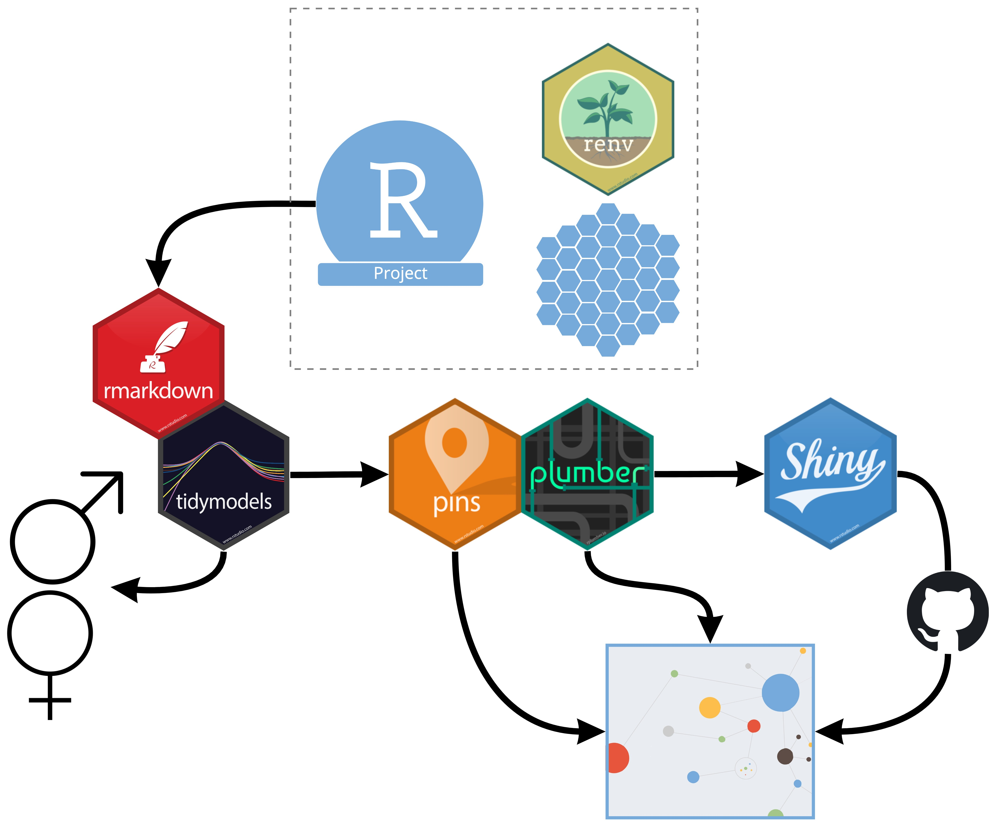

```{r setup, include=FALSE}
library(connectwidgets)
library(dplyr)

knitr::opts_chunk$set(echo = FALSE, message = FALSE, warning = FALSE)

client <- connect(
  server  = "https://colorado.rstudio.com/rsc",
  api_key = Sys.getenv("CONNECT_API_KEY")
  )

guids <- c("1dd2cf81-6c86-4523-9502-df4fee9255f8", # R Markdown
           "8e8d8e5e-d96c-4f02-9f4f-200e8847b6f4", # Pin
           "11be2b41-1142-4691-b6ad-6925e39f5382", # API
           "6dcd2865-2964-4927-b9d1-8a9d1221eac7") # Shiny App

penguins_content <- content(client = client) %>% 
  filter(guid %in% guids)


```



## Components

### Apps

```{r}
penguins_content %>% 
  filter(guid == "6dcd2865-2964-4927-b9d1-8a9d1221eac7") %>% 
  rsc_card()
```

### RMD

```{r}
penguins_content %>%
  filter(guid == "1dd2cf81-6c86-4523-9502-df4fee9255f8") %>% 
  rsc_grid()
```

### Pins

```{r}
penguins_content %>% 
  filter(guid %in% c("8e8d8e5e-d96c-4f02-9f4f-200e8847b6f4")) %>% 
  rsc_table()
```

### APIs

```{r}
penguins_content %>% 
  filter(guid %in% c("11be2b41-1142-4691-b6ad-6925e39f5382")) %>% 
  rsc_card()
```